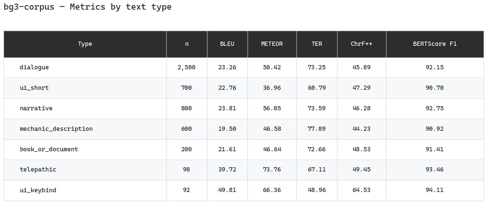

**English** | [Українська](README.uk.md)

# bg3-corpus — EN-UK Parallel Corpus from Baldur's Gate 3 Texts

A pipeline for building an English-Ukrainian parallel corpus from the
localization texts of Baldur's Gate 3, with automatic translation via the
Google Gemini API and computation of MT quality metrics.

The practical part of the bachelor's thesis **"Building a Parallel Corpus for
Machine Translation Based on Video Game Texts"** — Taras Shevchenko National
University of Kyiv, 2026.

---

## Materials

| Resource | Link |
| --- | --- |
| **Pipeline code (this repository)** | <https://github.com/ZavarOvek/bg3-corpus> |
| **Corpus and results (Google Drive)** | <https://drive.google.com/drive/folders/1PHGYLNj4pqAisXkIUog3smQXU3fxoZIZ?usp=sharing> |

> The corpus is hosted on Google Drive due to file size (~120 MB).

---

## Results (May 2026)

| Metric | Value |
| --- | --- |
| Total pairs in the corpus | **186,311** |
| Stratified sample for Gemini | 4,992 |
| Translated by Gemini | 4,992 (100%) |
| BLEU (aggregate) | 23.16 |
| METEOR | 49.57 |
| TER | 73.16 |
| ChrF++ | 46.75 |
| **BERTScore F1** | **91.93** |

### Metrics by text type

| Type | n | BLEU | METEOR | TER | ChrF++ | BERTScore F1 |
| --- | --- | --- | --- | --- | --- | --- |
| `dialogue` | 2,500 | 23.26 | 50.42 | 73.25 | 45.89 | 92.15 |
| `ui_short` | 700 | 22.76 | 36.96 | 60.79 | 47.29 | 90.70 |
| `narrative` | 800 | 23.81 | 56.05 | 73.59 | 46.28 | 92.75 |
| `mechanic_description` | 600 | 19.50 | 46.58 | 77.89 | 44.23 | 90.92 |
| `book_or_document` | 200 | 21.61 | 46.64 | 72.66 | 48.53 | 91.41 |
| `telepathic` | 98 | 39.72 | 73.76 | 67.11 | 49.45 | 93.46 |
| `ui_keybind` | 92 | 49.81 | 66.36 | 48.96 | 64.53 | 94.11 |



---

## Pipeline architecture

```
Localization/
  english.loca.xml   ──┐
  ukrainian.loca.xml ──┘
          │
          ▼  src/extract.py        XML → JSONL (232,876 + 218,232 records)
          ▼  src/align.py          alignment by contentuid → 218,232 pairs
          ▼  src/classify.py       7 semantic types
          ▼  src/filter.py         deduplication (-31,919) + metadata → 186,311
          ▼  src/make_sample.py    stratified sample of 4,992 (seed=42)
          ▼  src/gemini.py         Gemini API translation → gemini_results.jsonl
          ▼  src/build.py          assembly → corpus.jsonl
          ├──▶ src/stats.py        → stats.md
          └──▶ src/validate.py     → validation_results.md + validation_raw.jsonl
```

Full technical documentation: [TECHNICAL.md](TECHNICAL.md)

---

## The 7 text types

| Type | Heuristic | Example |
| --- | --- | --- |
| `dialogue` | fallback | "I'll help you find it." |
| `narrative` | `*...*` | `*The door swings open.*` |
| `telepathic` | `((*...*))` | `((*flesh-walker, tongue-talker*))` |
| `mechanic_description` | contains `<LSTag` | "Deals 1d4 Poison damage..." |
| `book_or_document` | `[Descriptive prefix...]` | "[A tattered journal entry.]" |
| `ui_short` | length <30, no punctuation | "Attack", "Cancel" |
| `ui_keybind` | starts with `[GLO_`, `[GEN_`, `[IE_` | "[GLO_Action_...]" |

---

## Installation

```bash
# Python 3.11+
pip install -r requirements.txt
python -m nltk.downloader punkt wordnet averaged_perceptron_tagger

# Gemini API key
echo "GEMINI_API_KEY=your_key_here" > .env
```

Requires the localization XML files from a legally purchased copy of BG3:

```
Localization/
  english.loca.xml
  ukrainian.loca.xml
```

---

## Running

```bash
# Steps 1-4: build the corpus (~2-3 minutes)
python src/extract.py
python src/align.py
python src/classify.py
python src/filter.py
python src/make_sample.py   # stratified sample of 4,992 records

# Step 5: Gemini translation (run daily, resumes automatically)
python src/gemini.py              # full run
python src/gemini.py --limit 10   # test: 10 records

# Steps 6-8: assembly and metrics
python src/build.py
python src/stats.py
python src/validate.py
```

> **Note on the Gemini API:** the free tier allows 500 requests/day. A full
> translation of 4,992 records takes ~10 sessions (~10 days). `gemini.py`
> automatically resumes from where it stopped.

---

## Repository contents

```
bg3-corpus/
├── src/
│   ├── scout_tags.py          # XML structure reconnaissance (one-off)
│   ├── extract.py             # XML → JSONL
│   ├── align.py               # EN-UK alignment
│   ├── classify.py            # classification into 7 types
│   ├── filter.py              # deduplication + metadata
│   ├── make_sample.py         # stratified sampling
│   ├── gemini.py              # Gemini API translation
│   ├── build.py               # corpus.jsonl assembly
│   ├── stats.py               # descriptive statistics
│   └── validate.py            # MT metrics
├── prompts/
│   └── gemini_v1.txt          # prompt (v3, final)
├── examples/                  # illustrative samples (10-20 records/type)
├── TECHNICAL.md               # full technical documentation
├── requirements.txt
├── LICENSE                    # MIT for the code; data licensed separately
└── README.md
```

**Corpus and results** (corpus.jsonl, validation_raw.jsonl, stats.md, etc.)
are on [Google Drive](https://drive.google.com/drive/folders/1PHGYLNj4pqAisXkIUog3smQXU3fxoZIZ?usp=sharing).

---

## Citation

```bibtex
@thesis{bg3corpus2026,
  author = {Karmana},
  title  = {Створення паралельного корпусу для машинного перекладу
            на основі текстів відеоігор},
  school = {Taras Shevchenko National University of Kyiv},
  year   = {2026},
  type   = {Bachelor's thesis},
  url    = {https://github.com/ZavarOvek/bg3-corpus}
}
```

---

## License

Pipeline code: **MIT**. See [LICENSE](LICENSE) for details.

The corpus texts are the intellectual property of Larian Studios and are used
strictly for academic purposes (fair use). The full corpus is not
redistributed.
